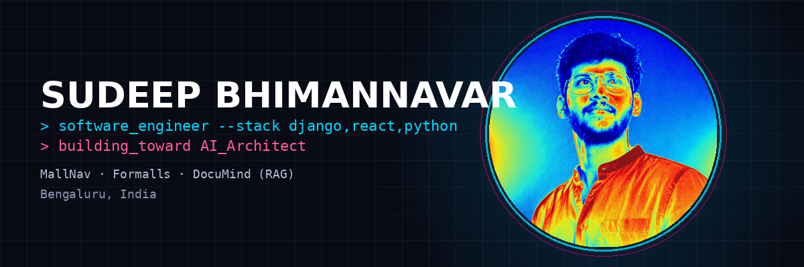
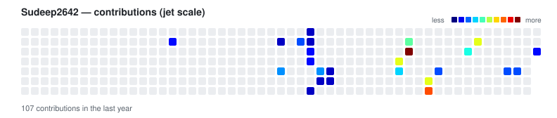

<div align="center">



<pre>
███████╗██╗   ██╗██████╗ ███████╗███████╗██████╗
██╔════╝██║   ██║██╔══██╗██╔════╝██╔════╝██╔══██╗
███████╗██║   ██║██║  ██║█████╗  █████╗  ██████╔╝
╚════██║██║   ██║██║  ██║██╔══╝  ██╔══╝  ██╔═══╝
███████║╚██████╔╝██████╔╝███████╗███████╗██║
╚══════╝ ╚═════╝ ╚═════╝ ╚══════╝╚══════╝╚═╝
</pre>

# Sudeep Bhimannavar
### Software Engineer · Bengaluru, India · Building toward AI Architecture

[+%40+Jain+University+%2725-%2727)](https://git.io/typing-svg)


&nbsp;
<a href="https://sudeep-bhimannavar.vercel.app/"></a>
&nbsp;
<a href="https://www.linkedin.com/in/sudeepbhimannavar-dev26/"></a>
&nbsp;
<a href="mailto:bhimannavarsudeep26@gmail.com"></a>

</div>

---

## ⚡ Who Am I?

I'm a **Software Engineer at Vividhity Ventures**, based in **Bengaluru, India 🇮🇳**, working across software engineering and sales for a multi-tenant SaaS platform. Alongside that, I'm pursuing an **MCA with an AI specialization** (Jain University, distance learning, 2025–2027) and building toward a longer-term goal: becoming an **AI Architect**.

My day-to-day core stack is **Django, React, Python, MySQL**, with **JWT/RBAC** for auth — and I'm actively growing into **Next.js and Node.js**. Outside work, I build AI-focused portfolio projects (Claude Vision, RAG pipelines) and put in daily DSA reps as I work toward a pure engineering role.

---

## 🚀 Featured Projects

<table>
<tr>
<td width="33%" valign="top">

### 🗺️ MallNav
**AI-Powered Indoor Navigation**

GPS dies indoors — MallNav doesn't. A Claude Vision API + OpenCV pipeline classifies floor-plan POIs, paired with a graph engine for real-time indoor pathfinding.

```
✅ Claude Vision API + OpenCV
   floor-plan parsing
✅ Graph-based pathfinding on
   dynamic weighted graphs
✅ Real-time path recalculation
```

**Stack:** `Python` `Claude Vision API` `OpenCV` `NetworkX`

</td>
<td width="33%" valign="top">

### 🏢 Formalls
**Multi-Tenant SaaS · Mall Management**

Production platform for mall operations. I lead frontend development — isolated tenant data, a clean design system, and a Django + React core.

```
✅ Multi-tenant architecture
✅ Role-based access control
✅ Django + React, in production
   at Vividhity
```

**Stack:** `Django` `React.js` `MySQL`

</td>
<td width="33%" valign="top">

### 📄 DocuMind
**RAG-Powered Document Q&A**

Next up on the portfolio roadmap — a retrieval-augmented Q&A system for querying documents conversationally.

```
🚧 Chunking + embeddings
🚧 Vector retrieval
🚧 LLM-grounded answers
```

**Stack:** `Python` `LangChain` `Vector DB` `Claude/OpenAI API`

</td>
</tr>
</table>

---

## 🛠️ Tech Arsenal

### 🧠 Languages


### 🏗️ Frameworks & Libraries


### 🤖 AI / LLM Engineering


### 🗄️ Databases


### ☁️ Cloud & Tools


---

## 📊 GitHub Stats

<div align="center">


</div>

<div align="center">

[](https://git.io/streak-stats)

</div>

---

## 📈 Contribution Activity — Jet Scale

<div align="center">

<picture>
  <source media="(prefers-color-scheme: dark)" srcset="./dist/dark.svg">
  
</picture>

</div>

*Auto-updated daily by a GitHub Action — see `scripts/generate_jet_heatmap.py`.*

---

## 🌱 Currently Building

```python
current_focus = {
    "shipping":   "DocuMind — RAG-powered document Q&A system",
    "maintaining": "MallNav & Formalls — both in production use",
    "dsa":        "Daily practice, alongside a full-time engineering role",
    "goal":       "Move into a pure engineering role; long-term: AI Architect",
}
```

---

## 🤝 Let's Build Something Together

<div align="center">

Open to conversations about applied AI, RAG systems, SaaS architecture, or engineering roles.

<a href="https://sudeep-bhimannavar.vercel.app/"></a>
<a href="https://www.linkedin.com/in/sudeepbhimannavar-dev26/"></a>
<a href="mailto:bhimannavarsudeep26@gmail.com"></a>

---

*📍 Bengaluru, India · Open to Remote Opportunities*

</div>
